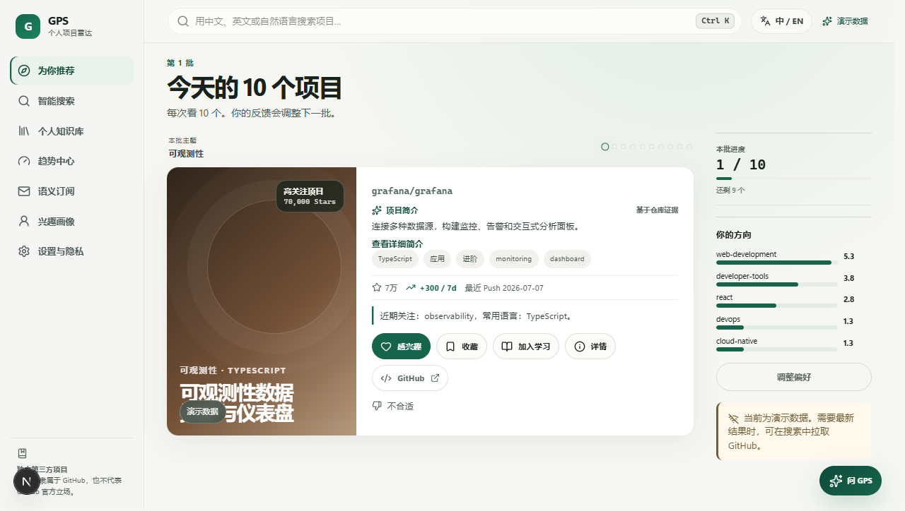
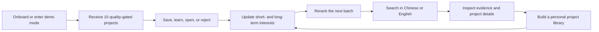
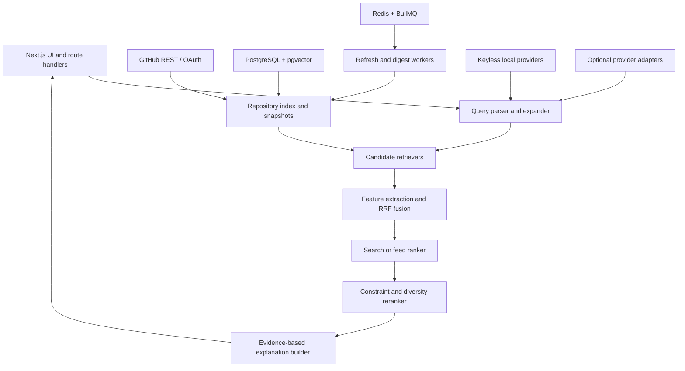

<p align="center">
  
</p>

<h1 align="center">GitHub Personal Search (GPS)</h1>

<p align="center">
  <strong>Find open-source projects worth your attention.</strong><br />
  A quality-first discovery workspace for bilingual natural-language search, personalized recommendations, trends, semantic subscriptions, and a personal project library.
</p>

<p align="center">
  <a href="#overview">Overview</a> ·
  <a href="#features">Features</a> ·
  <a href="#how-it-works">How it works</a> ·
  <a href="#getting-started">Getting started</a> ·
  <a href="#quality-and-evaluation">Quality</a> ·
  <a href="#project-status">Status</a>
</p>

<p align="center">
  
  
  
  
  <a href="https://github.com/lizr-phys/github-personal-search/actions/workflows/ci.yml"></a>
  
</p>

<p align="center">
  
</p>

> **Public preview:** GPS is a working, locally runnable MVP under active development. Search, recommendations, feedback, the project library, trends, subscriptions, mail preview, and the bilingual site agent are demonstrable without external keys. Durable multi-user production persistence is not complete yet; see [Project status](#project-status) before deploying publicly.

## Overview

GitHub is excellent at hosting code, but finding the right repository still requires translating a real-world need into repository names, keywords, and prior knowledge. GPS adds a discovery layer around open-source projects: it understands what a user is trying to accomplish, retrieves candidates through several channels, applies quality and constraint gates, personalizes ranking, and learns from explicit feedback.

The interface supports Chinese and English. The local fallback remains useful without GitHub OAuth, an embedding service, or an LLM key, and never presents fixed demo snapshots as live GitHub data.

| Product area | What GPS adds |
| --- | --- |
| Search | Structured intent, bilingual expansion, lexical and local-semantic retrieval, hard constraints, route clustering, and evidence-based explanations |
| Discovery | Daily warm candidates, fixed batches of 10, session-aware reranking, 30-day exposure suppression, quality gates, and controlled exploration |
| Project detail | Unified project summary, README evidence, maintenance and release signals, 1/7/30-day trends, alternatives, and learning actions |
| Personal library | Collections, states, tags, notes, history, learning logs, and explicit project relationships |
| Trends and subscriptions | Age-normalized momentum, semantic topic subscriptions, deduplication, and local email preview |
| User control | Editable interests, temporary-search isolation, undoable feedback, imported-data cleanup, profile reset, and account deletion |

## Product loop



## Features

- **Bilingual natural-language search** — rule parsing, technical entity normalization, synonyms, abbreviations, spelling aliases, negative constraints, and four intents: balanced, exact, inspiration, and latest.
- **Multi-channel retrieval** — local full-text, local semantic similarity, topic, project relation, profile, trend, exploration, and optional GitHub public search candidates are fused before ranking.
- **Quality-first recommendations** — mature repositories must pass configurable popularity and maintenance gates; promising new projects require recent activity plus attention or author evidence. Archived, mirrored, stale, duplicate, blocked, and recently exposed projects are penalized or removed.
- **Session-aware batches** — the first batch contains 10 projects; positive and negative feedback immediately changes the next batch without infinite scrolling or repeating recent exposures.
- **Auditable explanations** — project descriptions and recommendation reasons are built from repository metadata, README extracts, topics, releases, and user behavior. Missing evidence produces weaker wording instead of invented claims.
- **Personal technical memory** — collections, notes, custom tags, learning states, history, and relationships also feed the recommendation profile.
- **Trends, semantic subscriptions, and mail preview** — 1/7/30-day momentum, new and rising projects, saved query intent, 30-day delivery deduplication, and a Mailpit-friendly digest flow.
- **Bilingual site agent** — a bottom-right assistant can translate a goal into safe in-product routes and searches. DeepSeek is optional; deterministic local guidance is the default fallback.
- **Privacy controls** — users can undo feedback, pause or reset interests, remove imported stars or search history, revoke authorization, unsubscribe, and delete account data.
- **Sponsored-content boundary** — the future sponsored channel is feature-flagged, separately retrieved and logged, capped per batch, clearly labeled, and disabled by default.

## How it works

GPS is a modular Next.js application with explicit domain boundaries instead of ranking logic inside page components.



### Search pipeline

1. Parse a query into a validated `SearchIntent`: task, domains, project types, technologies, languages, platform, deployment, maturity, difficulty, license, negatives, and time intent.
2. Expand bilingual concepts through deterministic dictionaries and provider adapters with schema validation and a local fallback.
3. Recall bounded candidate sets from independent lexical, semantic, topic, relation, profile, trend, exploration, and optional GitHub channels.
4. Fuse channel ranks with Reciprocal Rank Fusion, then apply configurable relevance, quality, recency, personalization, novelty, and penalty features.
5. Enforce hard constraints and rerank for route, organization, language, and functional diversity.
6. Persist recall sources, features, exposure position, and algorithm version so a result can be replayed.

### Recommendation pipeline

The feed separates long-term interests, short-term intent, capability and cost, negative preferences, and exposure memory. Warm candidates are pre-ranked; session feedback only recomputes the bounded queue required for the next batch. “Already seen” suppresses repetition, while negative feedback changes the relevant preference scope. Exploration is configurable by scenario rather than treated as random noise.

Detailed formulas and weights live in [docs/search-and-ranking.md](docs/search-and-ranking.md), not in the UI.

## Getting started

### Requirements

- Node.js 22.13 or newer
- Corepack and pnpm 11.9
- Docker only when running PostgreSQL, Redis, and Mailpit locally

### Fastest path: keyless demo

No GitHub, database, mail, embedding, or LLM credentials are required.

```bash
cp .env.example .env
corepack enable
pnpm install --frozen-lockfile
pnpm dev
```

On Windows PowerShell, use `Copy-Item .env.example .env` for the first command. Open `http://localhost:3000`, choose demo mode, and complete the short interest setup to receive the first 10 projects. Local demo state is stored in `.data/gps-demo.json` and is ignored by Git.

### Local infrastructure

```bash
docker compose up -d postgres redis mailpit
pnpm db:migrate
pnpm db:seed
pnpm dev
```

Mailpit is available at `http://localhost:8025`.

### Optional GitHub and AI providers

Copy values into a local `.env`; never commit credentials.

```dotenv
GITHUB_CLIENT_ID=
GITHUB_CLIENT_SECRET=
GITHUB_WEBHOOK_SECRET=

AI_PROVIDER=local
DEEPSEEK_API_KEY=
DEEPSEEK_MODEL=deepseek-v4-flash
```

With no GitHub OAuth credentials, GPS can still fetch a bounded public repository index and combine it with clearly labeled demo snapshots. With no AI key, query understanding uses local multilingual dictionaries, hash-based semantic features, and extractive summaries. Provider timeouts, invalid output, and rate limits fall back to the same local path.

## Application routes

| Route | Purpose |
| --- | --- |
| `/` | Personalized project discovery and 10-item batches |
| `/onboarding` | Interests, languages, difficulty, seed projects, and quick feedback |
| `/search` | Query understanding, editable constraints, route clusters, and subscriptions |
| `/repository/[owner]/[repo]` | Evidence-backed project detail and learning actions |
| `/library` | Collections, notes, statuses, history, and relationships |
| `/trends` | New, rising, and major-update views across 1/7/30 days |
| `/subscriptions` | Semantic topics, thresholds, frequency, matches, and mail preview |
| `/profile/interests` | Long-term and short-term interests, exclusions, provenance, and controls |
| `/settings` | Authorization, privacy, imported data, and account deletion |

## Quality and evaluation

The repository includes deterministic unit, integration, end-to-end, accessibility, algorithm, performance, load, scale, and security checks. The latest recorded local baseline used 60 indexed repositories and 27 labeled query cases:

| Metric | Recorded result |
| --- | ---: |
| Unit tests | 42 / 42 passed |
| Integration tests | 13 / 13 passed |
| Recall@10 | 0.8333 |
| Precision@10 | 0.2284 |
| NDCG@10 | 0.8125 |
| MRR | 0.8782 |
| Hard-constraint violation rate | 0.51% |
| Duplicate rate | 0% |
| Average result clusters | 6.519 |
| 20k-repository feed rank and batch | 704.08 ms |
| 20k-repository cold search | 3627.47 ms |
| Warm search cache | 0.24 ms |

These are development-machine measurements, not production SLAs. Dataset size, hardware, and test limits are documented in [algorithm evaluation](docs/algorithm-evaluation.md), [performance baseline](docs/performance-baseline.md), and the [final quality report](docs/final-quality-report.md).

Run the main checks:

```bash
pnpm check
pnpm test:coverage
pnpm test:algorithm
pnpm test:scale
pnpm test:e2e -- --project=chrome
```

For API benchmarking, start the application first, then run:

```bash
pnpm test:performance -- --url http://localhost:3000
pnpm test:load -- --url http://localhost:3000
```

## Repository structure

| Path | Responsibility |
| --- | --- |
| `src/app` | Next.js pages, layouts, route handlers, metadata, and error states |
| `src/components` | Design system and product interaction components |
| `src/domain` | Domain entities, repositories, runtime stores, and business services |
| `src/search` | Query parsing, expansion, retrieval, features, ranking, clustering, and explanations |
| `src/recommendation` | Feed features, scoring, quality gates, quotas, exposure control, and diversity |
| `src/github` | OAuth, REST client, caching, rate-limit handling, and ingestion |
| `src/ai` | Local and remote provider abstractions with validated fallback behavior |
| `src/security` | Token handling, request protection, rate limits, webhook and proxy guards |
| `db` | Drizzle schema, SQL migrations, seed data, reset, and migration scripts |
| `workers` | BullMQ-compatible background refresh and digest entry points |
| `tests` | Unit, integration, end-to-end, accessibility, and algorithm fixtures |
| `tools` | Evaluation, API performance, load, and 20k-scale benchmark scripts |
| `docs` | Architecture, PRD traceability, design audit, deployment, security, and quality evidence |

## Documentation

- [Architecture](docs/architecture.md)
- [Search and recommendation](docs/search-and-ranking.md)
- [GitHub data ingestion](docs/data-ingestion.md)
- [Deployment](docs/deployment.md)
- [Privacy and security](docs/privacy-and-security.md)
- [Testing](docs/testing.md)
- [PRD traceability](docs/prd-traceability.md)
- [Assumptions and decisions](docs/assumptions-and-decisions.md)
- [Optimization decisions](docs/optimization-decisions.md)
- [Known limitations](docs/known-limitations.md)

## Security and privacy

- GitHub authorization requests the minimum public-data scope and protects OAuth state.
- Provider credentials remain server-side; `.env`, `.env.local`, runtime data, logs, and test artifacts are ignored.
- Inputs are validated with Zod, database access is parameterized, feedback writes are rate-limited, and security headers are configured centrally.
- Webhook signatures and mail feedback signatures are verified before state changes.
- The image proxy restricts protocol, host, response size, timeout, and content type to reduce SSRF risk.
- Destructive privacy actions are explicit and auditable.

Review [docs/privacy-and-security.md](docs/privacy-and-security.md) and [docs/security-best-practices-report.md](docs/security-best-practices-report.md) before any public deployment.

## Project status

GPS is published as a **development preview**, not a finished hosted service.

Ready now:

- Complete local demo loop without external credentials
- Search, recommendation, feedback, project details, library, trends, subscriptions, mail preview, interests, settings, and bilingual UI
- Public GitHub metadata ingestion and OAuth/provider interfaces
- PostgreSQL/pgvector schema, migrations, Redis/BullMQ boundaries, Docker Compose, and repeatable quality checks

Not production-complete yet:

- User-facing runtime state still uses the file/memory adapter; the PostgreSQL schema exists, but every product flow has not yet moved to durable Drizzle repositories.
- Horizontal multi-instance deployment requires PostgreSQL-backed runtime state plus Redis-backed cache, rate limits, and queue coordination.
- GitHub OAuth, live email delivery, and remote AI providers require operator-owned credentials and production verification.
- The current 60-repository demo corpus and 27-query relevance set are too small to train or claim a learned-to-rank model.
- The local semantic fallback is deterministic and multilingual, but it is not equivalent to a production embedding model.

Because of those boundaries, a durable public Vercel deployment is intentionally deferred. The recommended next milestone is the PostgreSQL runtime adapter, followed by managed Postgres, managed Redis, OAuth callback verification, and a preview deployment. The full list is maintained in [docs/known-limitations.md](docs/known-limitations.md).

## 中文说明

GPS 是一个面向全领域开源项目发现的双语产品，不限定物理、AI 或某一种技术方向。当前公开仓库是可本地运行的开发预览版：核心搜索、推荐、反馈、知识库、趋势、订阅和站内向导均可演示；生产级多用户持久化与正式公网部署仍在迭代中，未完成部分已在上文和文档中明确列出。

## Disclaimer

GPS is an independent third-party project. It is not affiliated with, endorsed by, or representative of GitHub. GitHub names and repository metadata remain subject to their respective owners and GitHub's terms.

## License

No open-source license has been selected for this preview. Unless a license is added later, all rights are reserved by the repository owner.
